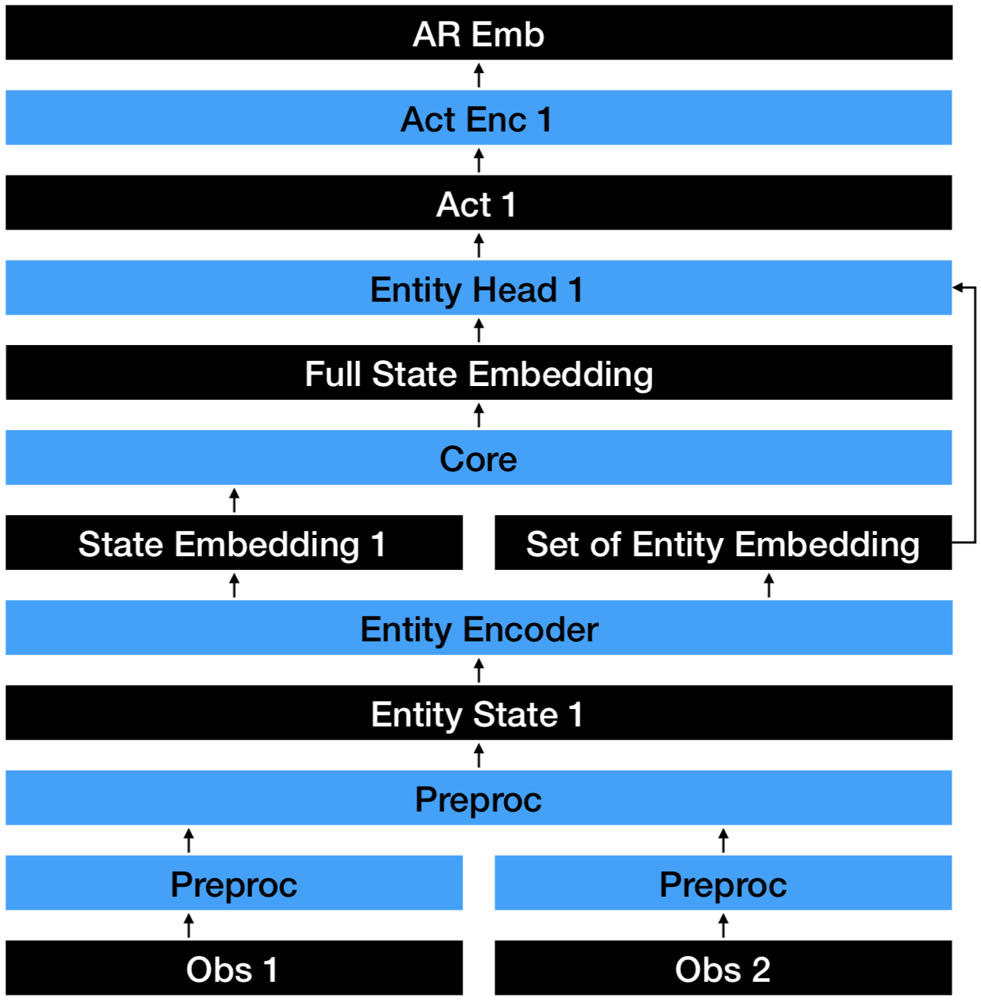

## Structure
```
.
└── unirl : Base directory
    ├── __init__.py
    ├── unirl_agent : Agent directory
    │   ├── __init__.py
    │   ├── libs
    │   │   ├── __init__.py
    │   │   ├── nn_layers.py : Module for minimal neural network parts
    │   │   ├── nn_models.py : Module for encoder and heads
    │   │   ├── rl_model.py : Module for generating whole model with configuration yaml
    │   │   ├── rl_preprocess.py : Preprocessing functions (used in runner, while rollout)
    │   │   └── rl_runner.py : Runner for rollout
    │   ├── rl_learn.py : Training process (under Multi-GPU)
    │   └── rl_learn_single_gpu.py : Training process (under Single-GPU)
    ├── unirl_env : Environment directory
    │   ├── __init__.py
    │   └── libs
    │       ├── __init__.py
    │       ├── configs : Configuration directory
    │       │   ├── action_config.yml : Action domain configuration (Discretization)
    │       │   ├── agent_config.yml : Agent configuration (Encoders and Heads)
    │       │   ├── env_config.yml : Environment configuration (Function sequence and environment setting)
    │       │   ├── learn_config.yml : Learing configuration (Hyperparameters)
    │       │   ├── obs_config.yml : Observation configuration (Raw return from environment)
    │       │   └── state_config.yml : State configuration (Preprocessed observation)
    │       ├── envlib : Environment function directory
    │       │   ├── __init__.py
    │       │   └── env_func.py : Environment functions
    │       └── utils : Utility directory
    │           ├── __init__.py
    │           └── config.py : Configuration utility
    └── train.py : Training Execution
```
## Configuration files

### action_config.yml
```
action_domain:
  action_1: [0, 1]
  action_2: [0.0, 0.1, 0.2, 0.3, 0.4, 0.5, 0.6, 0.7, 0.8]
  action_3: [100, 300, 500]
  ...
```
action_config.yml stands for defining action domain.
both environment and agent use this information.
environment uses it to generate neglogp_mask, and nextact_mask.


### agent_config.yml
```
state_encoder:
  - state: obs_1
    encoder: ScalarEncoder
    kwargs:
      d_x: 12
      d_encoder: 64
  - state: obs_2
    encoder: PolygonEncoder
    kwargs:
      d_seq: 32
      d_encoder: 64
  - state: obs_3
    encoder: PolygonEntityEncoder
    kwargs:
      d_seq: 4
      d_encoder: 64
core_encoder:
  encoder: Core
  kwargs:
    d_x: 1728
    d_head: 96
    ds_hidden: [768, 384, 192]
action_head:
  - action: action_1
    head: CategoricalHead
    kwargs: 
      d_out: 2
      d_head: 96
      ds_hidden: [32, 16, 8]
      ds_ar_hidden: [16, 32]
    rationales: [action_none]
  - action: action_2
    head: CategoricalHead
    kwargs: 
      d_out: 9
      d_head: 96
      ds_hidden: [32, 16]
      ds_ar_hidden: [16, 32]
    rationales: [action_1]
  - action: action_3
    head: EntityHead
    kwargs: 
      d_encoder: 64
      d_head: 96
    rationales: [action_2, entity_state_1]
```
agent_config.yml stands for defining agent encoder and decoder.

state_encoder sets encoder receives states.
- state : name of state defined in state configuration
- encoder : name of encoder class defined in nn_model
- kwargs : kwargs for defining state encoder

core_encoder sets encoder that concatenates whole states.
- encoder : name of encoder class defined in nn_model
- kwargs : kwargs for defining core encoder

action_head sets head that samples actions.
- action : name of action defined in action configuration
- head : name of head class defined in nn_model
- kwargs : kwargs for defining action head
- rationales : embedding used as rationale for action (for autoregressive policy, or entity selection)

### env_config.yml
```
env_func:
  - env_function_1
  - env_function_2
  - env_function_3
setting:
  env_setting_1: 1.e-3
  env_setting_2: 1.e-2
  env_setting_3: 1.e+0
```
env_config.yml stands for environment configuration

env_func defines sequence of environment functions

setting defines setting of environment

### learn_config.yml
```
learn_args:
  algorithm: ppo
  total_steps: 1.e+10
  batch_steps: 1024
  eval_episodes: 128
  n_minibatches_per_model: 4
  n_opt_epochs: 4
  lr: 3.e-4
  max_grad_norm: 0.5
  cliprange: 0.2
  coef_el: 0
  coef_vl: 0.5
  gam: 0.99
  lam: 0.95
  log_steps: 1
  debug: False
  save_path: ./ckpt
```
learn_config.yml stands for learning algorithm and hyperparameters
- algorithm : RL algorithm (ppo, a2c etc.)
- total_steps : Total running steps
- batch_steps : Batch size (number of rollout steps)
- eval_episodes : Episode size during evaluation
- n_minibatches_per_model : Number of minibatches per model while update
- n_opt_epochs : Number of epochs per policy / value update
- lr : Learning rate
- max_grad_norm : Gradient clipping norm
- cliprange : PPO objective clipping range
- coef_el : Entropy loss coefficient
- coef_vl : Value loss coefficient
- gam : Gamma value (reward discounting)
- lam : Lambda value (for temporal difference)
- log_steps : Logging interval steps
- debug : Whether use debug mode or not
- save_path : Save directory for checkpoint

### obs_config.yml
```
obs:
  obs_1:
    type: string
    default: aaaaa
    description: "blah blah blah"
  obs_2:
    type: string
    default: bbbbb
    description: "blah blah blah"
  obs_3:
    type: string
    default: ccccc
    description: "blah blah blah"
  obs_4:
    type: vector
    default: [1,0,0]
    description: "blah blah blah"
```
obs_config.yml stands for observation definition (every kind of information except fixed parameter is used as observation)
- type : Type of observation
- default : Default value of observation
- description : Description of observation

### state_config.yml
```
state:
  state_1:
    preprocess:
      - concatenate:
          kwargs:
            target:
              type: obs_list
              arg: [obs_1, obs_2, obs_3, obs_4, obs_5]
          return: state_1
    type: vector
    spec: 
      shape: [-1, 12]
      min: -1
      max: 1
    description:
  state_2:
    preprocess:
      - centralize:
          kwargs:
            target:
              type: obs
              arg: obs_6
            bounds:
              type: obs
              arg: obs_7
          return: obs_6_1
      - geometry_to_numpy:
          kwargs:
            target:
              type: obs
              arg: obs_6_1
          return: obs_6_2
      - adjust_vertices_arr:
          kwargs:
            target:
              type: obs
              arg: obs_6_2
            n_vertices:
              type: int
              arg: 32
          return: obs_6_3
      - normalize_20k:
          kwargs:
            target:
              type: obs
              arg: obs_6_4
          return: state_2
    type: array_polygon
    spec:
      shape: [-1, 32, 2]
      min: 1
      max: None
    description:
```
state_conf.yml stands for state definition. "state" means preprocessed observation which used as input of agent encoder
- preprocess : List of dictionary which key is preprocessing function name defined in preprocess
- kwargs : Kwargs of the preprocessing function
- return : Name(key) of returned value
- type : Type of state
- spec : Specification of state
if return is same as key of preprocess key, it will be used as preprocessed process

## RL overall flow


The image shows the overall flow of RL algorithm.  
Environment setting is fed to environment at the initialization(or reset) time.  
At every steps, environment will receive previous observation, action, and environment setting.  
Then environment will return next observation, reward, terminal flag, neglogp mask, nextact mask.
- observation : Raw observation from environment
- reward : Reward from environment
- terminal flag : Whether environment step is done or not
- neglogp mask : masking of actions that never used
- nextact mask : masking of actions that will used to next action sampling  

Agent will receive observation, and generate state with preprocessing, and receive also reward, terminal flag, neglogp mask, nextact mask.  
Agent will generate action, entropy, value, and negative log probability.  
This steps will be repeatedly applied to make a batch, then batch will fed to training process.  
Batch contains
- batch states
- batch actions
- batch action masks
- batch returns (which is advantage + value)
- batch values
- batch negative log probability
- batch negative log probability mask(backward action mask)  

Traning process is use this batch as data, and optimize its network with it.  
It will return gradients, and this gradients will be applied to training / rollout agents.  
If multiple gpu is used, multiple gradients will be averaged on master model.  

## RL neural network structure (with autoregressive policy)


The image shows the neural network structure.  
Each observation is preprocessed with multiple preprocessing functions to generate state.  
Each states will be embedded by the encoders.  
Embedded states will be concatenated in the core network, and generate full state embedding.  
From full state embedding, actions will be sampled with action heads.  
Each action has individual action head, depends on the action type.  
You can see the autoregressive policy on the right above.  
Head n receives AR Emb instead of Full State Embedding.  
On the condition that we can't get additional information with environment interaction, but have to sample multiple actions,(when we have to sample joint action from joint probability) we can divide these joint actions into conditional action with conditional probability, then apply autoregressive policy.  
When we have to sample Head n, but cannot interact with environment, but have dependency with Act n-1, we encodes Act n-1 to make embedding, and add this embedding to previous state embedding, then use this embedding as state embedding of Head n.  

## RL pointer network flow


The image shows the pointer network structure.  
When we have to select entity, using common architecture is not enough.  
When we encodes entity states with entity encoder, we also generate set of entity embeddings, not only state embedding.  
When we do entity selection with entity head, the head receives not only state embedding, also set of entity embeddings to select some information by attention weight.  

## RL multiprocessing distribution


The image shows the multiprocessing distribution structure.  
We have training model instances which number is same as number of GPUs.  
Each training model has multiple runners, which has fork of training model instance, but not on the GPU.  
Runners will perform rollout, and make batches asynchronously.  
With its own batch, training models on GPUs will perform training, compute gradients.  
Then we average those gradients and apply it to master training model.  
Then, slave training model and runner models will forked from this master model.  